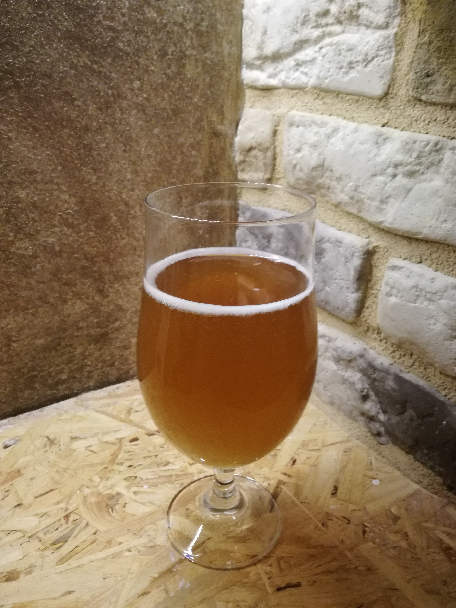

# American Wheat 11°Blg

  * Brewed on 27 Dec 2017
  * Silent fermentation started on 7 Jan 2017
  * Bottled on 20 Jan 2017
  * Recommended consumption after 3 Feb 2017
  * Recommended serving temperature 4-5°C

## Ingredients

  * Malts
    * Wheat Viking Malt 2kg
    * Pilsner Viking Malt 2kg
    * Munich Light (type I) Viking Malt 0.3kg
  * Hops
    * Columbus CTZ 10g 
    * Cascade 20g
    * Amarillo 10g
  * Not filtered
  * Not pasteurized

